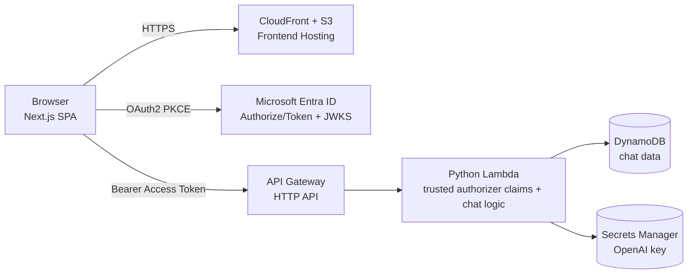
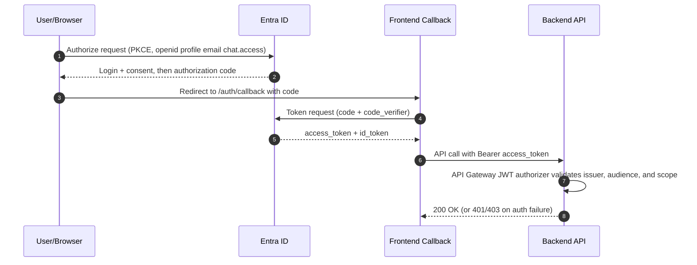
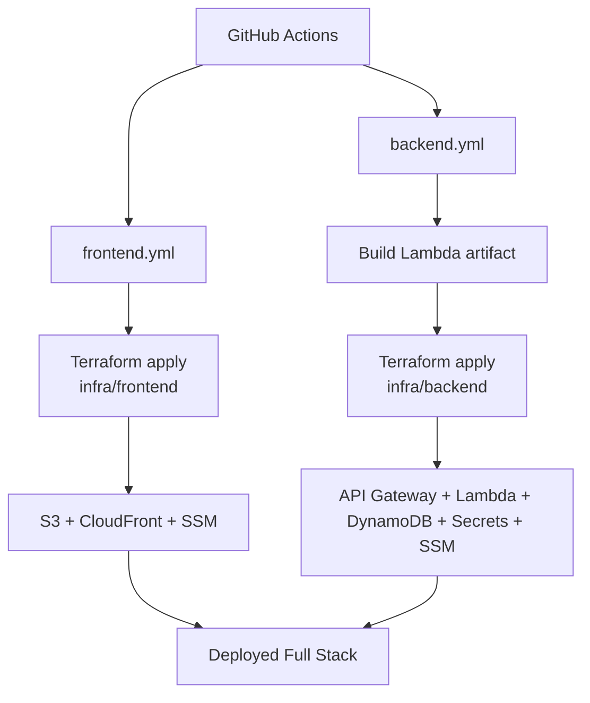

# AWS + Azure AD OIDC/JWT Example

This project is a serverless chat app with a Next.js frontend on AWS and a Python Lambda backend protected by API Gateway JWT authorizer using Microsoft Entra ID (Azure AD) delegated access tokens.

Goal: give new developers and coding agents a fast mental model of architecture, auth flow, and identity configuration.

Demo URL

```text
https://d1tja37xgctu7e.cloudfront.net/
```

## Secrets

Use these GitHub Actions secrets for CI/CD:

```text
AWS_ACCESS_KEY_ID
AWS_SECRET_ACCESS_KEY
AWS_REGION
AWS_ACCOUNT_ID
AZURE_APPLICATION_ID
AZURE_TENANT_ID
OPENAI_API_KEY
```

## ASCII Diagrams

### High-Level Architecture

```text
 +-------------------------+      HTTPS      +---------------------------+
 | Browser (Next.js SPA)   | --------------> | CloudFront + S3 (Static) |
 +------------+------------+                 +-------------+-------------+
              | OAuth2 (PKCE)                              | API calls (Bearer token)
              v                                            v
 +-----------------------------+             +---------------------------+
 | Microsoft Entra ID (AAD)    |             | API Gateway (HTTP API)   |
 | Authorize/Token + OIDC/JWKS |             +-------------+-------------+
 +--------------+--------------+                           |
                | Issuer + audience validation           v
                +------------------------------> +-----------------------+
                                               | Python Lambda         |
                                               | - Trusted claims only |
                                               | - OpenAI chat logic   |
                                               +-----------+-----------+
                                                           |
                       +-----------------------------------+-----------------------------------+
                       v                                                                       v
            +------------------------+                                      +-------------------------+
            | DynamoDB (chat data)   |                                      | Secrets Manager (OpenAI)|
            +------------------------+                                      +-------------------------+
```

### OAuth2 + API Authorization Flow

```text
 User/Browser            Entra ID              Frontend Callback             Backend API
      |                     |                         |                           |
 1)   | Click Sign In       |                         |                           |
      |-- authorize+PKCE -->|                         |                           |
      |<-- login/consent ---|                         |                           |
      |<-- code (redirect) -|--> /auth/callback ----->|                           |
      |                     |                         |                           |
 2)   | Exchange code for tokens                      |                           |
      |-- token+verifier -->|                         |                           |
      |<-- access_token,id_token                      |                           |
      |                     |                         |                           |
 3)   | Call protected API                             |                           |
      |------------------------------------------------ Authorization: Bearer ----->|
      |                     |                         |                           |
 4)   |                     |<-- API Gateway validates JWT (iss, aud, scp) -----------|
      |<---------------------------------- 200 OK (or 401/403) ---------------------|
```

### CI/CD and Infra Flow

```text
         GitHub Actions
               |
       +-------+--------+
       |                |
       v                v
   frontend.yml     backend.yml
       |                |
       |                +--> Build Lambda artifact
       +--> Terraform apply (infra/frontend)
       |                +--> Terraform apply (infra/backend)
       v                v
  S3 + CloudFront + SSM   API GW + Lambda + DynamoDB + Secrets + SSM
               \          /
                \        /
                 +------+
                    |
                    v
             Deployed Full Stack
```

## Mermaid Diagrams

### High-Level Architecture (Mermaid)



### OAuth2 + API Authorization Flow (Mermaid)



### CI/CD and Infra Flow (Mermaid)



## Architecture At A Glance

### Frontend

- Next.js app (static export) in `frontend/`
- Hosted on S3, delivered through CloudFront
- Uses OAuth 2.0 Authorization Code Flow with PKCE directly against Microsoft identity platform

### Backend

- Python Lambda in `backend/src/handler.py`
- Exposed via API Gateway HTTP API
- Persists chat data in DynamoDB
- Reads OpenAI API key from AWS Secrets Manager
- Uses API Gateway JWT authorizer for Azure AD token validation

### Infrastructure

- Terraform for frontend in `infra/frontend/`
- Terraform for backend in `infra/backend/`
- Runtime/discovery values are published to AWS SSM Parameter Store
- CI/CD via GitHub Actions workflows in `.github/workflows/`

## Auth Flow (End To End)

1. User opens login page and clicks Microsoft sign-in.
2. Frontend creates PKCE verifier/challenge and redirects to Azure authorize endpoint.
3. Requested scopes include OpenID scopes plus API delegated scope (`chat.access`).
4. Azure returns an authorization code to frontend callback.
5. Frontend exchanges code for tokens at Azure token endpoint (PKCE, no client secret).
6. Frontend stores tokens in browser session storage.
7. Frontend calls backend with `Authorization: Bearer <access_token>`.
8. API Gateway JWT authorizer validates token signature/issuer/audience/scope.
9. Lambda reads trusted claims from API Gateway authorizer context and enforces user-level access:

- User identity from `oid` claim (fallback to `sub`)
- Session isolation per authenticated user

10. If valid, backend serves chat APIs; otherwise returns 401/403.

## Azure AD Setup (What Was Configured)

The settings below are template values and can be reused as a baseline for future updates.

### Current Deployment Template Values

- Tenant ID: `<tenant-id>`
- Application (client) ID: `<application-id>`
- Application ID URI: `api://<application-id>`
- Delegated scope value: `chat.access`
- Frontend base URL: `https://<cloudfront-domain>`
- Redirect URI: `https://<cloudfront-domain>/auth/callback`
- Post-logout redirect URI: `https://<cloudfront-domain>`

### 1. App Registration For OAuth2 SPA Login

- Platform: **Single-page application (SPA)**
- Redirect URI:
     - `https://<cloudfront-domain>/auth/callback`
- Post-logout redirect URI:
     - `https://<cloudfront-domain>`
- OAuth2 Authorization Code + PKCE flow is used from browser (no client secret in frontend).

### 2. Expose API Scope

- Application ID URI set to:
     - `api://<application-id>`
- Delegated scope created and enabled:
     - Scope name: `chat.access`
     - Enabled: `true`
     - Who can consent: **Admins and users**

Also configure pre-authorized client application mapping:

- Client app ID: `<application-id>`
- Delegated permission ID: `<chat-access-scope-guid>` (scope `chat.access`)

### 3. API Permissions

- Client app requests delegated permission to the exposed API scope (`chat.access`)
- OpenID scopes requested for sign-in profile claims (`openid`, `profile`, `email`)
- Tenant admin consent can be granted when organization policy requires it
- Required resource access includes:
     - Resource app ID: `<application-id>` with delegated scope `chat.access`
- Optional: add Microsoft Graph delegated scope `User.Read` (`resourceAppId`: `<microsoft-graph-app-id>`) if your organization or UI flow requires it.

### 4. Supported Account Types

- This repo is configured for single-tenant use only.
- Use your tenant ID endpoint (not `common`):
- `https://login.microsoftonline.com/<tenant-id>/oauth2/v2.0/authorize`
- `https://login.microsoftonline.com/<tenant-id>/oauth2/v2.0/token`

### 5. Manifest Requirements (Important)

Set these values in the Entra app manifest:

- `identifierUris` contains `api://<application-id>`
- `api.oauth2PermissionScopes` includes enabled scope `chat.access`
- `api.preAuthorizedApplications` contains this app ID and delegated permission ID for `chat.access`
- `api.requestedAccessTokenVersion` = `2`

Without `requestedAccessTokenVersion: 2`, access tokens can fail API Gateway JWT issuer validation (v2.0 endpoint expected).

## Runtime Configuration (Conceptual)

Frontend requires:

- Azure tenant ID (single tenant)
- Azure application (client) id
- Redirect and logout URLs
- API scope string in the shape `api://<application-id>/chat.access`
- Backend API base URL

Backend requires:

- Azure tenant ID (single tenant)
- Azure application id used as expected audience
- Required scope (`chat.access`)
- DynamoDB table name
- OpenAI secret ARN

### Frontend: What scope is requested

- `frontend/hooks/use-auth.ts`
- Reads `NEXT_PUBLIC_AZURE_API_SCOPE` from environment
- Sends `scope=openid profile email <api-scope>` to Azure authorize endpoint
- Sends same scope set in token exchange request

### Frontend CI: What scope gets baked into the static build

- `.github/workflows/frontend.yml`
- Sets `NEXT_PUBLIC_AZURE_API_SCOPE` as `api://${AZURE_APPLICATION_ID}/chat.access`
- Result: this value is compiled into frontend assets at build time

### Frontend runtime config: What is loaded at request time

- `frontend/lib/runtime-config.ts`
- Fetches `/config.json` at browser runtime with `cache: "no-store"`
- Reads `chatApiBaseUrl` so API endpoint can be updated without rebuilding frontend assets

### Backend Terraform: What API Gateway is configured to enforce

- `infra/backend/variables.tf`
- `azure_required_scope` default is `chat.access`
- `infra/backend/main.tf`
- Configures API Gateway JWT authorizer issuer as `https://login.microsoftonline.com/<tenant-id>/v2.0`
- Configures audience as `<application-id>` and `api://<application-id>` (Option A compatibility mode)
- Applies required scope `chat.access` on all protected chat routes

### Backend runtime: What Lambda trusts on every API call

- `backend/src/handler.py`
- Reads claims from `requestContext.authorizer.jwt.claims`
- Uses `oid`/`sub` claims to isolate per-user chat sessions
- Returns 401 if authorizer claims are missing

## CI/CD And Deployment

- Frontend workflow builds static assets, deploys to S3, invalidates CloudFront
- Backend workflow builds Lambda artifact, applies Terraform, updates secret value, and runs health smoke test
- Terraform bootstrap workflows create/destroy remote state prerequisites

## Repo Map

- `frontend/`: Next.js UI and OAuth client flow
- `backend/`: Lambda source and packaging
- `infra/frontend/`: S3 + CloudFront + SSM outputs
- `infra/backend/`: API Gateway + Lambda + DynamoDB + Secrets + SSM outputs

## Security Notes

- Never commit secrets, app IDs, tenant IDs, tokens, or key material.
- Keep least-privilege IAM and Azure permissions.
- Use delegated scope checks on backend for every protected route.
- Rotate secrets and review token validation assumptions regularly.

## Troubleshooting Quick Checks

If login or API auth fails, verify in order:

1. Scope exists and is enabled in Azure (`chat.access`).
2. Application ID URI matches the requested scope prefix (`api://<application-id>`).
3. Frontend is requesting the exact scope string.
4. Access token `aud` matches backend expected audience.
5. Access token `scp` contains `chat.access`.
6. Redirect URI in Azure exactly matches deployed callback URL.
7. Tenant/account-type and consent policy align with the user account being tested.
8. In Entra app manifest, set `api.requestedAccessTokenVersion` to `2` so access tokens match API Gateway v2 issuer validation.
9. After Azure setting changes, sign out and clear browser session storage (`oauth2.azuread.session`) before retesting.
